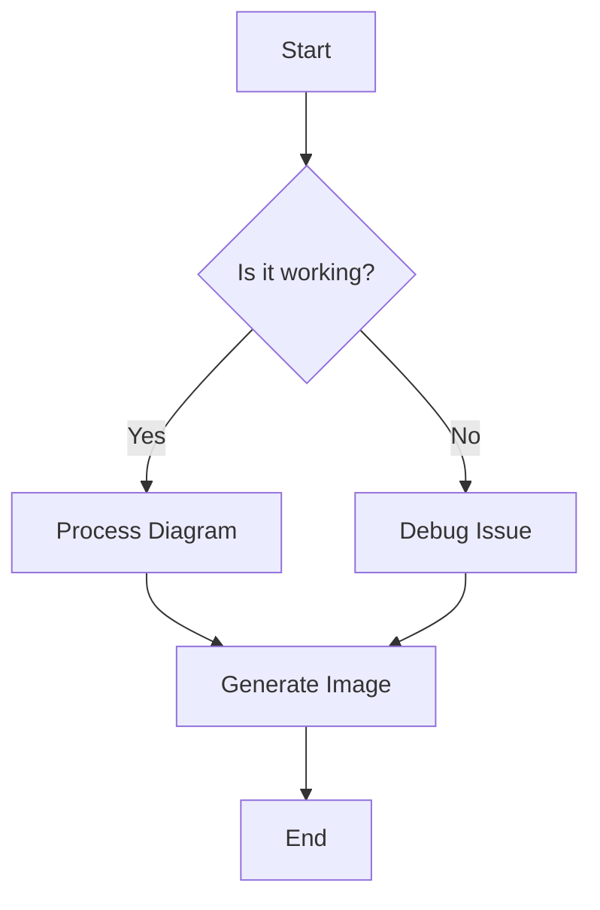
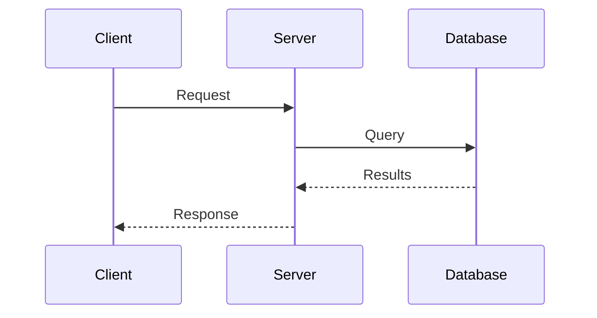
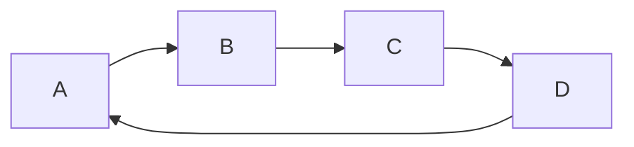

# Mermaid Diagram Test

This is a test file to verify Mermaid diagram conversion functionality.

## Flowchart Example

## Sequence Diagram Example

## Regular Text Content

This is regular Markdown content that should remain unchanged.

* Item 1
* Item 2
* Item 3

## Another Flowchart

This document contains multiple Mermaid diagrams that should be converted to images during the conversion process.